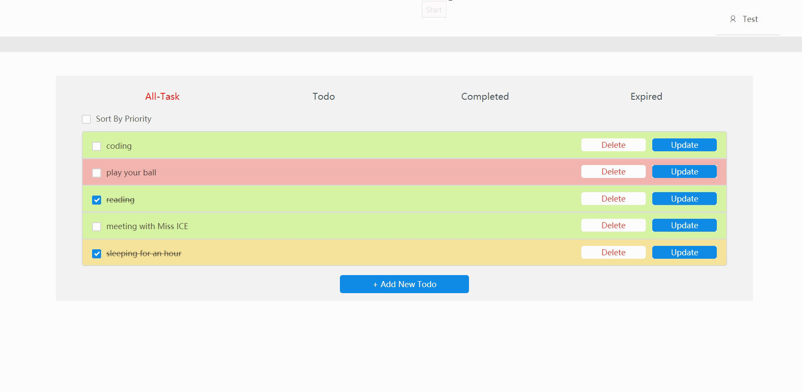
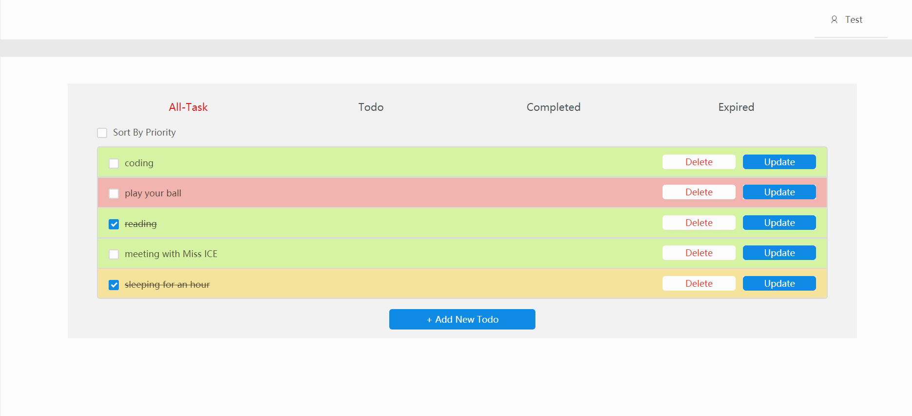
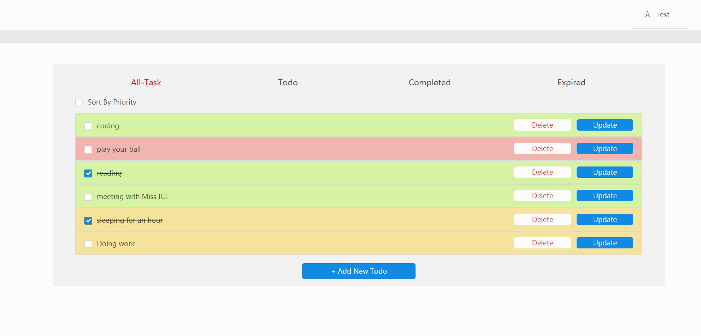

# Pre work - Todo List

## What I have done

### Basic：

- [x] 增加一个待办事项
- [x] 删除一个待办事项
- [x] 标记一个待办事项为已完成
- [x] 编辑一个待办事项的具体内容
- [x] 列出所有的待办事项

### Optional：

- [ ] 列表界面支持翻页
- [x] 待办事项可以设置优先级
- [x] 待办事项可以设置expire date
- [x] 支持按照不同的方式排序，如优先级，expire date
- [x] Using antd, redux

## Page Cuts

- Create Todo:

- Mark Todo:

- Update/delete/sort:

## How to run
### Front-end:
- yarn install
- yarn start

### Back-end:
- pip install Django==1.8.17
- pip install djangorestframework==3.5.4
- pip install django-cors-headers
- pip install markdown
- pip install django-filter
- pip install psycopg2
- Add a database **todo** and a table named **todolist_todo** in your postgresql server
- cd ./prework_server
- python manage.py runserver

### get in http://localhost:3000/ in your browser to see result

## License
- MIT License
